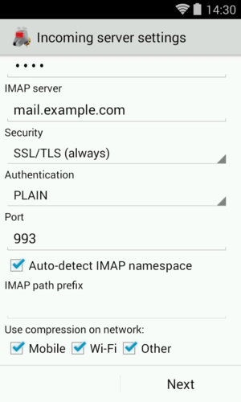
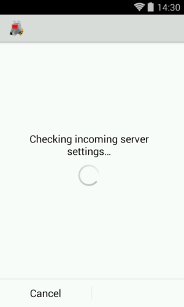

# IMAP Server Settings

The following images show all the [IMAP](/documentation/accounts/imap) related settings. 
Later we describe them in detail.  Note that on a smartphone, your popped-up soft keyboard may be 
covering some of these entry fields; don't forget to scroll.

&nbsp;

**Username**: This is the username that's needed to authenticate to the IMAP server. The field is initialized with the user part of your email address. Some servers are okay with this; some, generally those which support multiple domains, require that you fill in your entire email address here. In this case, if you entered the entire email address on the previous screen, you will need to re-enter the hostname part here, as K-9 Mail doesn't know whether you need it and assumes you don't.

**Password**: Here you enter the password to access your emails. The password you entered at the first step of the account creation process is pre-entered here. So you shouldn't need to change it. This password is the one which an administrator set for you or gave to you, which you use to retrieve mail from the mailbox.

**IMAP server**: This is the hostname or IP address of your IMAP server. Note that this address must resolve to your mail server no matter what network you're connected to -- if you provide a name or IP that's only resolvable *inside your private network*, that's the only place you'll be able to pick up email. (If you don't understand the preceding, then you probably don't need to worry about it.) Some firewalls can also cause trouble here.

**Security**: This specifies the cryptographic protocol that should be used when connecting to your IMAP server. Available options are:

* None: This doesn't use any transport security at all.
* SSL/TLS (if available): SSL/TLS is used but the certificate isn't checked.
* **SSL/TLS (always)**: SSL/TLS is used and the certificate presented must be valid.
* STARTTLS (if available): The STARTTLS method is used if available; the certificate isn't checked. If STARTTLS is not available, no encryption is used at all and email will be moved in the clear.
* **STARTTLS (always)**: The STARTTLS method is used and the certificate is checked for validity.

*Note*: Avoid using the options *"None"*, *"SSL/TLS (if available)"*, and *"STARTTLS (if available)"* if you can. Check the chapter [Security](Manual-Security) for more information on this.

**Authentication**: This specifies which authentication method to use after you have a valid, hopefully encrypted, connection. Available options are:

* **PLAIN**: This is the default method. You shouldn't need to change this.
* **CRAM_MD5**: Use this if your server doesn't support transport security but supports the CRAM_MD5 authentication method.

**Port**: This is the port number the IMAP server is listening on. Most of the time you don't want to change this. It will generally be port 143 for non-encrypted connections or 993 for encrypted ones. If your port number is something else, the mail server administrator should have told you.

**IMAP path prefix**: The content of this field is prepended to IMAP folder names before use. The main usage is to manually select which IMAP namespace to use. As the entry field notes, this can be automatically guessed, so usually, you don't need to change this.

**Show only subscribed folders**: If this is enabled K-9 Mail will only display subscribed folders. If you don't know what that means leave it disabled.

**Use compression on network**: If your server supports compression (DEFLATE) it is used on the selected networks to minimize the amount of data transferred. Selecting this, even if your server doesn't support compression, doesn't cause problems. So there should be no need to change these.

After clicking "Next" K-9 Mail tries to connect to the server to verify the settings. This means you need to have a working network connection to continue the setup.

After the server settings are checked you can now continue to [configure the outgoing server](/documentation/accounts/add#outgoing-server).
